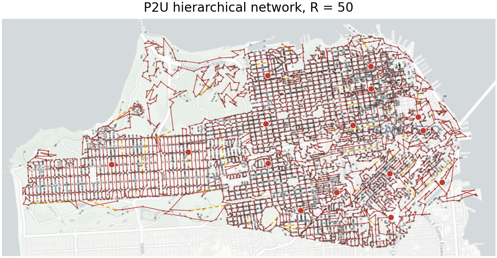

# P2U Hierarchical Redundancy Sweep (exact)

## Results

**Goal**: prepare an article-level P2U experiment where a road-constrained 2-edge-connected backbone is built under a redundancy target and all remaining transformers are attached as a street forest.

**Main result**: the demand-aware R50 ILP protects substantially more contracted-chain demand than the previous length-only objective, but the resulting network is still not a good reliability design. It reduces the first-order tree/section risk strongly, yet creates very large second-order generalized-chain risk because the 2-connected backbone has long, unbalanced effective chains.

All reliability rows use deterministic decomposition with a fixed original-network length failure rate calibrated to `p_mean = 5e-4`.

Compact comparison, normalized against the original total risk where noted:

| network | cost_km | R | total_risk | Z_F | O(p) risk | O(p)/F0 | O(p^2) chain risk | O(p^2)/F0 |
| --- | --- | --- | --- | --- | --- | --- | --- | --- |
| Original P2U MV | 589.34 | 171 | 2.27e-3 | 0.00 | 2.26e-3 | 99.73% | 6.15e-6 | 0.27% |
| Demand-aware road R50 | 667.28 | 50 | 2.04e-3 | 0.10 | 6.83e-4 | 30.14% | 1.35e-3 | 59.75% |

The R50 demand-aware backbone selected `234,825 kVA` of the `330,950 kVA` demand represented inside contracted corridor sections (`70.95%`). The ILP was time-limited but feasible and 2-edge-connected.

| network | r_request | length_km | r_theory | z_w | z_r | z_f | z_f_p | z_f_p2 | risk_total | risk_o_p | risk_o_p2 | risk_tree | risk_section | risk_internal | risk_structural | bridges | generalized_chains | gen_lambda_mean_km | gen_lambda_sigma_over_mean | gen_lambda_max_km | selected_chain_demand_kva | selected_chain_demand_fraction | ilp_runtime_s | decomposition_runtime_s |
| --- | --- | --- | --- | --- | --- | --- | --- | --- | --- | --- | --- | --- | --- | --- | --- | --- | --- | --- | --- | --- | --- | --- | --- | --- |
| Original P2U MV |  | 5.89e2 | 171 | 0 | 0 | 0 | 0 | 0 | 2.27e-3 | 2.26e-3 | 6.15e-6 | 2.26e-3 | 0 | 3.61e-7 | 5.79e-6 | 8921 | 324 | 3.24e-1 | 1.45e0 | 4.04e0 |  |  |  | 5.37e0 |
| Hierarchical road R50 | 50 | 6.67e2 | 50 | -1.32e-1 | 7.08e-1 | 1.01e-1 | 6.98e-1 | -2.19e2 | 2.04e-3 | 6.83e-4 | 1.35e-3 | 3.37e-4 | 3.46e-4 | 3.13e-5 | 1.32e-3 | 3621 | 113 | 4.47e0 | 1.61e0 | 4.46e1 | 234825 | 7.10e-1 | 9.01e2 | 6.66e0 |

**Figures**:

- `Hierarchical road R50`: 
- QGIS project: `R050/p2u_final_network_R50.qgs`
- QGIS styled switch layers: `R050/p2u_final_network_R50.style_layers.gpkg`

**Insights**:

- `O(p) = Tree + Section` is the first-order bridge/section risk.
- `O(p^2) = Internal + Structural` is the second-order chain and generalized-chain risk.
- `gen_lambda_*` reports demand-normalized generalized-chain effective lengths, using `tilde_lambda_q = lambda_q sqrt(Q w_q / W)`.
- The R50 case is kept as the first benchmark because it shows that reducing tree risk is not enough: low redundancy can move risk into the generalized chains.
- The demand-aware ILP solves the missing contracted-chain coverage problem, but not the generalized-chain balance problem.
- This run enforces exact source-contracted redundancy, so `r_request` should match `r_theory` for successful rows.


**What this does not show**:

- This stage produces a simulation table and preview maps, not the final article figure layout.
- ILP results are only as strong as the recorded Gurobi status and MIP gap for each row.
- The experiment remains connectivity reliability, not voltage/power-flow validation.

**Reproduce**:

```powershell
& C:\Users\rotem\anaconda3\envs\reliability\python.exe figures\optimal_hierarchy\redundancy_sweep.py --redundancy-mode exact --r-values 50 --reuse-existing
```

## Algorithm

For each requested redundancy value, the pipeline uses the road-corridor terminal graph and solves a 2-edge-connected backbone ILP. In `min_length` mode it solves:

$$
\min \sum_e w_e x_e
$$

In `max_chain_demand_then_min_length` mode it first maximizes selected demand represented by contracted degree-2 corridor sections, then fixes that demand level and minimizes length:

$$
\max \sum_e q_e x_e, \qquad \min \sum_e w_e x_e \;\; \mathrm{subject\ to\ the\ selected\ } \sum_e q_e x_e.
$$

subject to degree, source-incidence, lazy 2-edge cut constraints, and the selected redundancy constraint:

$$
|E_\mathrm{selected}| - |V| + 1 = R_\mathrm{target}.
$$

The final graph attaches non-backbone transformer terminals using shortest paths on the street network and contracts street/transformer chains into switch-section edges.

The reliability split is:

$$
F = F_{O(p)} + F_{O(p^2)}, \quad F_{O(p)} = F_\mathrm{tree} + F_\mathrm{section}, \quad F_{O(p^2)} = F_\mathrm{internal} + F_\mathrm{structural}.
$$

Relative indexes are computed against the original P2U MV network:

$$
Z_W = 1 - W/W_0, \quad Z_R = 1 - R/R_0, \quad Z_F = 1 - F/F_0.
$$

Current parameters:

- `p_mean = 0.0005`
- `time_limit = 900.0` s
- `MIPGap = 0.05`
- `Threads = 0`
- `cut_mode = callback`
- `objective_mode = max_chain_demand_then_min_length`
- `coverage_attr = edge_size_kva`
- `tree_mode = street_forest`
- `generalized_method = projection`
- `redundancy_mode = exact`
- `fixed_original_length_failure_rate = True`

## Implementation

Entry point:

- `figures/optimal_hierarchy/redundancy_sweep.py`

Shared code reused from the exploratory P2U implementation:

- `figures/optimal_sfo/prepare_p2u_corridor_network.py` builds the road-corridor candidate graph.
- `figures/optimal_sfo/run_p2u_ilp_2edge.py` solves the backbone ILP.
- `figures/optimal_sfo/p2u_final_network.py` builds the final backbone-plus-forest graph.
- `figures/optimal_sfo/analyze_p2u_final_network.py` computes topology, load, and length summaries.
- `figures/optimal_sfo/compare_p2u_old_new_reliability.py` provides the deterministic risk-decomposition path.

Outputs:

- `outputs\optimal_hierarchy\exact\p2u_hierarchical_redundancy_sweep_exact_table.csv`
- `outputs\optimal_hierarchy\exact\p2u_hierarchical_redundancy_sweep_exact_table.json`
- `outputs\optimal_hierarchy\exact\p2u_hierarchical_redundancy_sweep_exact.md`
- `outputs\optimal_hierarchy\exact\p2u_hierarchical_redundancy_sweep_exact_diagnostic.png`
- `outputs\optimal_hierarchy\exact/R*/p2u_final_network_*_map.png`

Stage log:

```json
{
  "parameters": {
    "p_mean": 0.0005,
    "ilp_time_limit_s": 900.0,
    "ilp_mip_gap": 0.05,
    "ilp_threads": 0,
    "ilp_max_cut_rounds": 100,
    "ilp_cut_mode": "callback",
    "ilp_objective_mode": "max_chain_demand_then_min_length",
    "ilp_coverage_attr": "edge_size_kva",
    "ilp_coverage_tolerance": 1e-06,
    "tree_mode": "street_forest",
    "generalized_method": "projection",
    "redundancy_mode": "exact",
    "fixed_original_length_failure_rate": true
  },
  "cases": {
    "50": {
      "backbone": {
        "status": 9,
        "status_name": "TIME_LIMIT",
        "stop_reason": "2edge_connected",
        "runtime_s": 901.3911533355713,
        "cut_rounds": 703,
        "added_cuts": 29613,
        "objective_length_m": 514252.8318146307,
        "best_bound": 329675.0,
        "mip_gap": 0.4039178111359523,
        "input_nodes": 5296,
        "input_edges": 16985,
        "solution_nodes": 5296,
        "solution_edges": 5345,
        "solution_cycle_rank": 50,
        "solution_connected": true,
        "solution_bridge_count": 0,
        "solution_is_2edge_connected": true,
        "redundancy_constraint": 50,
        "max_redundancy_constraint": null,
        "time_limit_s": 900.0,
        "threads": 0,
        "requested_mip_gap": 0.05,
        "cut_mode": "callback",
        "source_connectivity_constraints": 15,
        "warm_start_edges": 5345,
        "objective_mode": "max_chain_demand_then_min_length",
        "coverage_attr": "edge_size_kva",
        "objective_phases": [
          {
            "phase": "maximize_chain_demand",
            "status": 9,
            "status_name": "TIME_LIMIT",
            "stop_reason": "2edge_connected",
            "runtime_s": 901.384599685669,
            "cut_rounds": 703,
            "added_cuts": 29613,
            "solution_count": 10,
            "objective_value": 234825.0,
            "best_bound": 329675.0,
            "mip_gap": 0.4039178111359523,
            "selected_edge_coverage_weight": 234825.0,
            "selected_length_m": 514252.8318146307
          },
          {
            "phase": "minimize_length_at_chain_demand",
            "status_name": "SKIPPED_TIME_LIMIT",
            "runtime_s": 0.0,
            "cut_rounds": 0,
            "added_cuts": 0,
            "selected_edge_coverage_weight": 234825.0,
            "selected_length_m": 514252.8318146307
          }
        ],
        "best_bound_phase": "minimize_length_at_chain_demand",
        "node_coverage_weight": 545145.0,
        "total_edge_coverage_weight": 330950.0,
        "selected_edge_coverage_weight": 234825.0,
        "selected_total_coverage_weight": 779970.0,
        "selected_edge_coverage_fraction": 0.7095482701314398,
        "selected_total_coverage_fraction": 0.8902801636808794,
        "selected_original_sources_with_incident_edge": 15,
        "original_sources_with_candidate_edges": 15,
        "warm_start_gpkg": "C:\\Users\\rotem\\Desktop\\\u05de\u05e1\u05de\u05db\u05d9\u05dd\\\u05ea\u05d5\u05d0\u05e8\\\u05ea\u05d6\u05d4\\\u05e1\u05d9\u05de\u05d5\u05dc\u05e6\u05d9\u05d5\u05ea\\cost_effective\\outputs\\optimal_hierarchy\\exact\\R050\\p2u_backbone_R50_3857.gpkg",
        "redundancy_mode": "exact",
        "output_gpkg": "C:\\Users\\rotem\\Desktop\\\u05de\u05e1\u05de\u05db\u05d9\u05dd\\\u05ea\u05d5\u05d0\u05e8\\\u05ea\u05d6\u05d4\\\u05e1\u05d9\u05de\u05d5\u05dc\u05e6\u05d9\u05d5\u05ea\\cost_effective\\outputs\\optimal_hierarchy\\exact\\R050\\p2u_backbone_R50_3857.gpkg",
        "stage_status": "solved"
      },
      "final_network": {
        "input_backbone_gpkg": "C:\\Users\\rotem\\Desktop\\\u05de\u05e1\u05de\u05db\u05d9\u05dd\\\u05ea\u05d5\u05d0\u05e8\\\u05ea\u05d6\u05d4\\\u05e1\u05d9\u05de\u05d5\u05dc\u05e6\u05d9\u05d5\u05ea\\cost_effective\\outputs\\optimal_hierarchy\\exact\\R050\\p2u_backbone_R50_3857.gpkg",
        "final_graph_definition": "switch-section graph: graph nodes are transformer/source terminals plus optional zero-load street branch nodes; degree-2 transformer chains are stored as edge load; tree mode is street_forest",
        "tree_mode": "street_forest",
        "retained_backbone_road_nodes": 5310,
        "all_backbone_terminal_sequence_road_nodes": 8174,
        "total_transformers_in_data": 12373,
        "unattached_tree_terminal_count": 0,
        "tree_attachment_physical_road_union_length_m": 153028.4491595659,
        "street_branch_nodes": 240,
        "lv_assignment": {
          "lv_components": 12373,
          "lv_nodes": 69004,
          "lv_edges": 56631,
          "lv_components_without_transformer": 0,
          "lv_components_with_multiple_transformers": 0,
          "consumer_points_total": 46379,
          "consumer_points_assigned_to_mv": 46379,
          "consumer_points_unassigned": 0,
          "consumer_points_assigned_by_nearest_transformer_fallback": 196,
          "nearest_transformer_fallback_mean_distance_m": 44.595398456044656,
          "nearest_transformer_fallback_max_distance_m": 203.9177052137165,
          "demand_kw_total_raw": 661466.7399999977,
          "demand_kw_assigned_to_mv": 661466.74,
          "num_customers_total_raw": 191140.0,
          "num_customers_assigned_to_mv": 191140.0,
          "yearly_kwh_total_raw": 5876669360.610104,
          "yearly_kwh_assigned_to_mv": 5876669360.61,
          "transformer_nodes_with_assigned_consumers": 12373
        },
        "output_gpkg": "C:\\Users\\rotem\\Desktop\\\u05de\u05e1\u05de\u05db\u05d9\u05dd\\\u05ea\u05d5\u05d0\u05e8\\\u05ea\u05d6\u05d4\\\u05e1\u05d9\u05de\u05d5\u05dc\u05e6\u05d9\u05d5\u05ea\\cost_effective\\outputs\\optimal_hierarchy\\exact\\R050\\p2u_final_network_R50_streetforest_3857.gpkg",
        "metadata_json": "C:\\Users\\rotem\\Desktop\\\u05de\u05e1\u05de\u05db\u05d9\u05dd\\\u05ea\u05d5\u05d0\u05e8\\\u05ea\u05d6\u05d4\\\u05e1\u05d9\u05de\u05d5\u05dc\u05e6\u05d9\u05d5\u05ea\\cost_effective\\outputs\\optimal_hierarchy\\exact\\R050\\p2u_final_network_R50_streetforest_metadata.json",
        "stage_runtime_s": 20.17318330006674,
        "stage_status": "built"
      },
      "risk_json": "C:\\Users\\rotem\\Desktop\\\u05de\u05e1\u05de\u05db\u05d9\u05dd\\\u05ea\u05d5\u05d0\u05e8\\\u05ea\u05d6\u05d4\\\u05e1\u05d9\u05de\u05d5\u05dc\u05e6\u05d9\u05d5\u05ea\\cost_effective\\outputs\\optimal_hierarchy\\exact\\R050\\p2u_final_network_R50_risk.json",
      "plot": {
        "stage_status": "plotted",
        "output_png": "C:\\Users\\rotem\\Desktop\\\u05de\u05e1\u05de\u05db\u05d9\u05dd\\\u05ea\u05d5\u05d0\u05e8\\\u05ea\u05d6\u05d4\\\u05e1\u05d9\u05de\u05d5\u05dc\u05e6\u05d9\u05d5\u05ea\\cost_effective\\outputs\\optimal_hierarchy\\exact\\R050\\p2u_final_network_R50_map.png",
        "plot_runtime_s": 6.964792500017211,
        "normally_closed_backbone_edges": 5307,
        "normally_open_tie_edges": 38
      },
      "case_runtime_s": 941.588664400042
    }
  },
  "corridors": {
    "status": "reused",
    "output_gpkg": "C:\\Users\\rotem\\Desktop\\\u05de\u05e1\u05de\u05db\u05d9\u05dd\\\u05ea\u05d5\u05d0\u05e8\\\u05ea\u05d6\u05d4\\\u05e1\u05d9\u05de\u05d5\u05dc\u05e6\u05d9\u05d5\u05ea\\cost_effective\\outputs\\optimal_sfo\\p2u_terminal_corridors_road2_k10_3857.gpkg"
  },
  "reference_failure_rate_per_length": 1.0798531853768255e-05,
  "total_runtime_s": 962.37241489999
}
```

No project research log was found at `codex/documents/research_logs/research_log.md`, so no research-log entry was updated.
