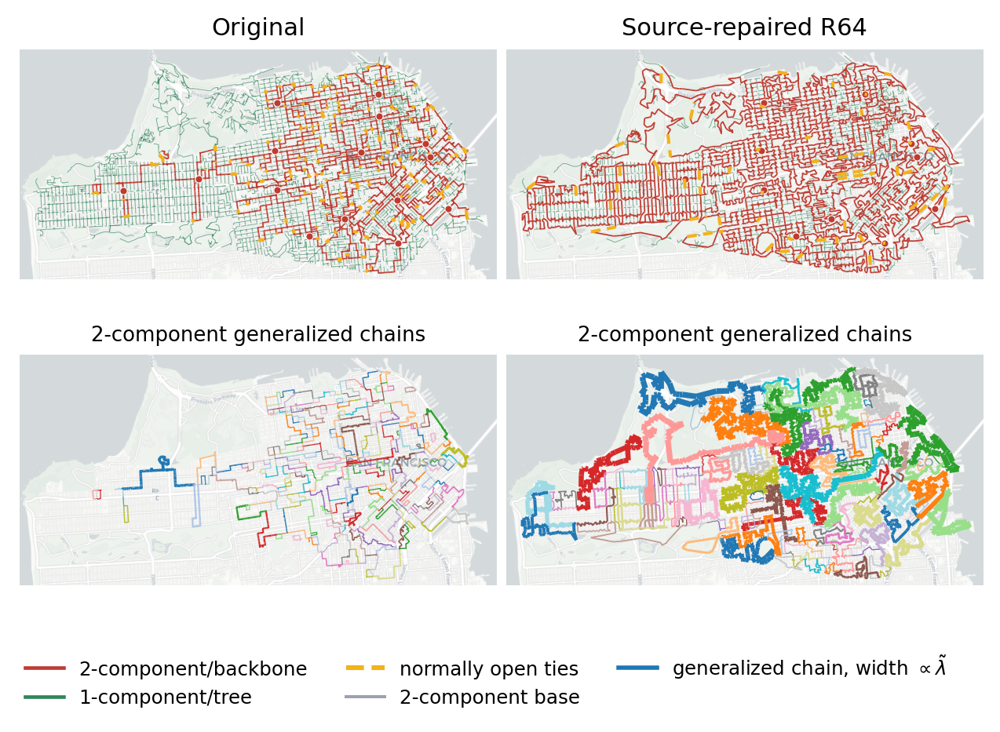

# P2U Hierarchical Redundancy Sweep (exact)

## Results

**Goal**: prepare an article-level P2U experiment where a road-constrained 2-edge-connected backbone is built under a redundancy target and all remaining transformers are attached as a street forest.

**Main result**: the demand-aware ILP protects contracted-chain demand that the length-only objective can ignore. The reliability result must still be judged by the decomposition: reducing the first-order tree/section risk is not enough if the selected 2-connected backbone creates long, unbalanced generalized chains and a large `O(p^2)` component.

All reliability rows use deterministic decomposition with `p_mean = 0.0005`. When `fixed_original_length_failure_rate=True`, this is converted once on the original network into a fixed failure rate per meter and reused for every network.

| network | r_request | length_km | r_theory | z_w | z_r | z_f | z_f_p | z_f_p2 | risk_total | risk_o_p | risk_o_p2 | risk_tree | risk_section | risk_internal | risk_structural | bridges | generalized_chains | gen_lambda_mean_km | gen_lambda_sigma_over_mean | gen_lambda_max_km | selected_chain_demand_kva | selected_chain_demand_fraction | chain_extra_cost_budget_km | selected_chain_extra_cost_km | fixed_outside_tree_cost_km | chain_tree_service_cost_km | ilp_runtime_s | decomposition_runtime_s |
| --- | --- | --- | --- | --- | --- | --- | --- | --- | --- | --- | --- | --- | --- | --- | --- | --- | --- | --- | --- | --- | --- | --- | --- | --- | --- | --- | --- | --- |
| Original P2U MV |  | 5.89e2 | 171 | 0 | 0 | 0 | 0 | 0 | 2.27e-3 | 2.26e-3 | 6.15e-6 | 2.26e-3 | 0 | 3.61e-7 | 5.79e-6 | 8921 | 324 | 3.24e-1 | 1.45e0 | 4.04e0 |  |  |  |  |  |  |  | 7.33e0 |
| Hierarchical road R64 | 64 | 6.15e2 | 64 | -4.33e-2 | 6.26e-1 | 5.04e-1 | 7.31e-1 | -8.30e1 | 1.12e-3 | 6.08e-4 | 5.17e-4 | 3.66e-4 | 2.41e-4 | 1.37e-5 | 5.03e-4 | 4493 | 128 | 3.13e0 | 1.45e0 | 2.75e1 | 165700 | 5.01e-1 | 3.93e2 | 3.93e2 | 1.03e2 | 1.05e2 | 0 | 8.17e0 |

**Figures**:

- `Original vs source-repaired R64 generalized chains`: 

**Insights**:

- `O(p) = Tree + Section` is the first-order bridge/section risk.
- `O(p^2) = Internal + Structural` is the second-order chain and generalized-chain risk.
- `gen_lambda_*` reports demand-normalized generalized-chain effective lengths, using `tilde_lambda_q = lambda_q sqrt(Q w_q / W)`.
- The R50 case is kept as the first benchmark because it shows that a low-redundancy 2-connected backbone can leave a large `O(p^2)` component.
- This run enforces exact source-contracted redundancy, so `r_request` should match `r_theory` for successful rows.


**What this does not show**:

- This stage produces a simulation table and preview maps, not the final article figure layout.
- ILP results are only as strong as the recorded Gurobi status and MIP gap for each row.
- The experiment remains connectivity reliability, not voltage/power-flow validation.

**Reproduce**:

```powershell
& C:\Users\rotem\anaconda3\envs\reliability\python.exe figures\optimal_hierarchy\redundancy_sweep.py --redundancy-mode exact --r-values 64 --reuse-existing
```

## Algorithm

For each requested redundancy value, the pipeline uses the road-corridor terminal graph and solves a 2-edge-connected backbone ILP. In `min_length` mode it solves:

$$
\min \sum_e w_e x_e
$$

In `max_chain_demand_then_min_length` mode it first maximizes selected demand represented by contracted degree-2 corridor sections, then fixes that demand level and minimizes length:

$$
\max \sum_e q_e x_e, \qquad \min \sum_e w_e x_e \;\; \mathrm{subject\ to\ the\ selected\ } \sum_e q_e x_e.
$$

In `max_chain_demand_under_cost` mode, used for the current cost-comparable experiment, each contracted chain has a radial-service baseline `L_q - max_l l_{q,l}` and an extra backbone cost `max_l l_{q,l}`. The model maximizes selected chain demand subject to:

$$
\sum_q \max_l \ell_{q,l} x_q \leq \alpha W_0 - W_\mathrm{fixed\ tree} - \sum_q \left(L_q - \max_l \ell_{q,l}\right).
$$

subject to degree, source-incidence, lazy 2-edge cut constraints, and the selected redundancy constraint:

$$
|E_\mathrm{selected}| - |V| + 1 = R_\mathrm{target}.
$$

The final graph attaches non-backbone transformer terminals using shortest paths on the street network and contracts street/transformer chains into switch-section edges.

The reliability split is:

$$
F = F_{O(p)} + F_{O(p^2)}, \quad F_{O(p)} = F_\mathrm{tree} + F_\mathrm{section}, \quad F_{O(p^2)} = F_\mathrm{internal} + F_\mathrm{structural}.
$$

Relative indexes are computed against the original P2U MV network:

$$
Z_W = 1 - W/W_0, \quad Z_R = 1 - R/R_0, \quad Z_F = 1 - F/F_0.
$$

Current parameters:

- `p_mean = 0.0005`
- `time_limit = 600.0` s
- `MIPGap = 0.05`
- `Threads = 0`
- `cut_mode = callback`
- `objective_mode = max_chain_demand_under_cost`
- `coverage_attr = edge_size_kva`
- `source_min_incident_edges = 2`
- `cost_alpha = 1.02`
- `tree_mode = street_forest`
- `generalized_method = projection`
- `redundancy_mode = exact`
- `fixed_original_length_failure_rate = True`

## Implementation

Entry point:

- `figures/optimal_hierarchy/redundancy_sweep.py`

Shared code reused from the exploratory P2U implementation:

- `figures/optimal_sfo/prepare_p2u_corridor_network.py` builds the road-corridor candidate graph.
- `figures/optimal_sfo/run_p2u_ilp_2edge.py` solves the backbone ILP.
- `figures/optimal_sfo/p2u_final_network.py` builds the final backbone-plus-forest graph.
- `figures/optimal_sfo/analyze_p2u_final_network.py` computes topology, load, and length summaries.
- `figures/optimal_sfo/compare_p2u_old_new_reliability.py` provides the deterministic risk-decomposition path.

Outputs:

- `outputs\optimal_hierarchy\exact\p2u_hierarchical_redundancy_sweep_exact_table.csv`
- `outputs\optimal_hierarchy\exact\p2u_hierarchical_redundancy_sweep_exact_table.json`
- `outputs\optimal_hierarchy\exact\p2u_hierarchical_redundancy_sweep_exact.md`
- `outputs\optimal_hierarchy\exact\p2u_hierarchical_redundancy_sweep_exact_diagnostic.png`
- `outputs\optimal_hierarchy\exact/R*/p2u_final_network_*_map.png`

Stage log:

```json
{
  "parameters": {
    "p_mean": 0.0005,
    "ilp_time_limit_s": 600.0,
    "ilp_mip_gap": 0.05,
    "ilp_threads": 0,
    "ilp_max_cut_rounds": 100,
    "ilp_cut_mode": "callback",
    "ilp_objective_mode": "max_chain_demand_under_cost",
    "ilp_coverage_attr": "edge_size_kva",
    "ilp_coverage_tolerance": 1e-06,
    "ilp_source_min_incident_edges": 2,
    "cost_alpha": 1.02,
    "tree_mode": "street_forest",
    "generalized_method": "projection",
    "redundancy_mode": "exact",
    "fixed_original_length_failure_rate": true
  },
  "cases": {
    "64": {
      "backbone": {
        "status": 2,
        "status_name": "HEURISTIC_SOURCE_REPAIRED",
        "stop_reason": "source_redundant_edges_added",
        "runtime_s": 0.0,
        "cut_rounds": 0,
        "added_cuts": 0,
        "objective_length_m": 442855.2587236611,
        "best_bound": null,
        "mip_gap": null,
        "input_nodes": 5296,
        "input_edges": 16985,
        "solution_nodes": 5296,
        "solution_edges": 5359,
        "solution_cycle_rank": 64,
        "solution_connected": true,
        "solution_bridge_count": 0,
        "solution_is_2edge_connected": true,
        "redundancy_constraint": 64,
        "max_redundancy_constraint": null,
        "time_limit_s": 0.0,
        "threads": 0,
        "requested_mip_gap": null,
        "cut_mode": "heuristic",
        "source_connectivity_constraints": 15,
        "source_min_incident_edges": 2,
        "insufficient_source_degree_candidates": {
          "S:SM37709": 1
        },
        "warm_start_edges": 5345,
        "objective_mode": "add_source_redundant_edges",
        "coverage_attr": "edge_size_kva",
        "chain_extra_cost_budget_m": 392542.5734814036,
        "cost_budget_components": {
          "cost_alpha": 1.02,
          "original_length_m": 589339.3737389606,
          "total_cost_budget_m": 601126.1612137398,
          "fixed_outside_tree_length_m": 103398.54033462063,
          "fixed_outside_transformer_road_nodes": 2059,
          "fixed_outside_unattached_road_nodes": 0,
          "candidate_road_nodes": 9496,
          "chain_tree_service_length_m": 105185.04739771555,
          "chain_extra_cost_budget_m": 392542.5734814036
        },
        "best_bound_phase": null,
        "node_coverage_weight": 545145.0,
        "total_edge_coverage_weight": 330950.0,
        "total_chain_tree_service_length_m": 105185.04739771555,
        "total_chain_extra_cost_m": 2881418.7084078114,
        "selected_chain_extra_cost_m": 393185.31471008644,
        "selected_edge_coverage_weight": 165700.0,
        "selected_total_coverage_weight": 710845.0,
        "selected_edge_coverage_fraction": 0.5006798610061943,
        "selected_original_sources_with_incident_edge": 15,
        "original_sources_with_candidate_edges": 15,
        "source_repair_added_edges": 14,
        "source_repair_added_edge_keys": [
          {
            "source": "S:SM17742",
            "edge": [
              "T:SM17700",
              "__SOURCE__"
            ]
          },
          {
            "source": "S:SM30718",
            "edge": [
              "T:SM30663",
              "__SOURCE__"
            ]
          },
          {
            "source": "S:SM31056",
            "edge": [
              "T:SM30346",
              "__SOURCE__"
            ]
          },
          {
            "source": "S:SM31207",
            "edge": [
              "T:SM31105",
              "__SOURCE__"
            ]
          },
          {
            "source": "S:SM46129",
            "edge": [
              "T:SM46221",
              "__SOURCE__"
            ]
          },
          {
            "source": "S:SM53914",
            "edge": [
              "T:SM53816",
              "__SOURCE__"
            ]
          },
          {
            "source": "S:SM58668",
            "edge": [
              "T:SM58182",
              "__SOURCE__"
            ]
          },
          {
            "source": "S:SM64541",
            "edge": [
              "T:SM63954",
              "__SOURCE__"
            ]
          },
          {
            "source": "S:SM65353",
            "edge": [
              "T:SM65941",
              "__SOURCE__"
            ]
          },
          {
            "source": "S:SM68190",
            "edge": [
              "T:SM67775",
              "__SOURCE__"
            ]
          },
          {
            "source": "ST:SM49899",
            "edge": [
              "T:SM50439",
              "__SOURCE__"
            ]
          },
          {
            "source": "ST:SM54027",
            "edge": [
              "T:SM53939",
              "__SOURCE__"
            ]
          },
          {
            "source": "ST:SM58361",
            "edge": [
              "T:SM56868",
              "__SOURCE__"
            ]
          },
          {
            "source": "ST:SM6797",
            "edge": [
              "T:SM6763",
              "__SOURCE__"
            ]
          }
        ],
        "output_gpkg": "C:\\Users\\rotem\\Desktop\\\u05de\u05e1\u05de\u05db\u05d9\u05dd\\\u05ea\u05d5\u05d0\u05e8\\\u05ea\u05d6\u05d4\\\u05e1\u05d9\u05de\u05d5\u05dc\u05e6\u05d9\u05d5\u05ea\\cost_effective\\outputs\\optimal_hierarchy\\exact\\R064\\p2u_backbone_R64_3857.gpkg",
        "stage_status": "reused"
      },
      "final_network": {
        "input_backbone_gpkg": "C:\\Users\\rotem\\Desktop\\\u05de\u05e1\u05de\u05db\u05d9\u05dd\\\u05ea\u05d5\u05d0\u05e8\\\u05ea\u05d6\u05d4\\\u05e1\u05d9\u05de\u05d5\u05dc\u05e6\u05d9\u05d5\u05ea\\cost_effective\\outputs\\optimal_hierarchy\\exact\\R064\\p2u_backbone_R64_3857.gpkg",
        "final_graph_definition": "switch-section graph: graph nodes are transformer/source terminals plus optional zero-load street branch nodes; degree-2 transformer chains are stored as edge load; tree mode is street_forest",
        "tree_mode": "street_forest",
        "retained_backbone_road_nodes": 5310,
        "all_backbone_terminal_sequence_road_nodes": 7317,
        "total_transformers_in_data": 12373,
        "unattached_tree_terminal_count": 0,
        "tree_attachment_physical_road_union_length_m": 171994.85733976171,
        "street_branch_nodes": 255,
        "lv_assignment": {
          "lv_components": 12373,
          "lv_nodes": 69004,
          "lv_edges": 56631,
          "lv_components_without_transformer": 0,
          "lv_components_with_multiple_transformers": 0,
          "consumer_points_total": 46379,
          "consumer_points_assigned_to_mv": 46379,
          "consumer_points_unassigned": 0,
          "consumer_points_assigned_by_nearest_transformer_fallback": 196,
          "nearest_transformer_fallback_mean_distance_m": 44.595398456044656,
          "nearest_transformer_fallback_max_distance_m": 203.9177052137165,
          "demand_kw_total_raw": 661466.7399999977,
          "demand_kw_assigned_to_mv": 661466.74,
          "num_customers_total_raw": 191140.0,
          "num_customers_assigned_to_mv": 191140.0,
          "yearly_kwh_total_raw": 5876669360.610104,
          "yearly_kwh_assigned_to_mv": 5876669360.61,
          "transformer_nodes_with_assigned_consumers": 12373
        },
        "output_gpkg": "C:\\Users\\rotem\\Desktop\\\u05de\u05e1\u05de\u05db\u05d9\u05dd\\\u05ea\u05d5\u05d0\u05e8\\\u05ea\u05d6\u05d4\\\u05e1\u05d9\u05de\u05d5\u05dc\u05e6\u05d9\u05d5\u05ea\\cost_effective\\outputs\\optimal_hierarchy\\exact\\R064\\p2u_final_network_R64_streetforest_3857.gpkg",
        "metadata_json": "C:\\Users\\rotem\\Desktop\\\u05de\u05e1\u05de\u05db\u05d9\u05dd\\\u05ea\u05d5\u05d0\u05e8\\\u05ea\u05d6\u05d4\\\u05e1\u05d9\u05de\u05d5\u05dc\u05e6\u05d9\u05d5\u05ea\\cost_effective\\outputs\\optimal_hierarchy\\exact\\R064\\p2u_final_network_R64_streetforest_metadata.json",
        "stage_runtime_s": 34.465687899966724,
        "stage_status": "built"
      },
      "risk_json": "C:\\Users\\rotem\\Desktop\\\u05de\u05e1\u05de\u05db\u05d9\u05dd\\\u05ea\u05d5\u05d0\u05e8\\\u05ea\u05d6\u05d4\\\u05e1\u05d9\u05de\u05d5\u05dc\u05e6\u05d9\u05d5\u05ea\\cost_effective\\outputs\\optimal_hierarchy\\exact\\R064\\p2u_final_network_R64_risk.json",
      "plot": null,
      "case_runtime_s": 48.01523489993997
    }
  },
  "corridors": {
    "status": "reused",
    "output_gpkg": "C:\\Users\\rotem\\Desktop\\\u05de\u05e1\u05de\u05db\u05d9\u05dd\\\u05ea\u05d5\u05d0\u05e8\\\u05ea\u05d6\u05d4\\\u05e1\u05d9\u05de\u05d5\u05dc\u05e6\u05d9\u05d5\u05ea\\cost_effective\\outputs\\optimal_sfo\\p2u_terminal_corridors_road2_k10_3857.gpkg"
  },
  "reference_failure_rate_per_length": 1.0798531853768255e-05,
  "total_runtime_s": 75.78147809999064
}
```

No project research log was found at `codex/documents/research_logs/research_log.md`, so no research-log entry was updated.
